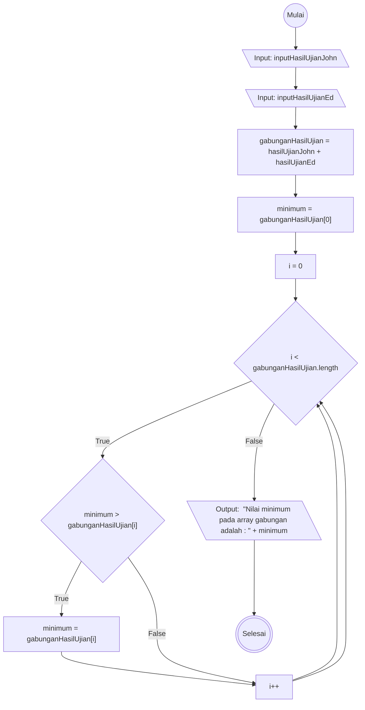

```mermaid
flowchart TD

start@{"shape": circle, "label": "Mulai"}
inputHasilUjianJohn@{"shape": lean-l, "label": "Input: inputHasilUjianJohn"}
inputHasilUjianEd@{"shape": lean-l, "label": "Input: inputHasilUjianEd"}
combineHasilUjian@{"shape": rectangle, "label": "gabunganHasilUjian = hasilUjianJohn + hasilUjianEd"}

%% Minimum
minimumEqGabunganZero@{"shape": rectangle, "label": "minimum = gabunganHasilUjian[0]"}
iEqZero@{"shape": rectangle, "label": i = 0}
isIltgabunganLength@{"shape": diamond, "label": "i < gabunganHasilUjian.length"}
isIltgabunganLengthTrue@{"shape": diamond, "label": "minimum > gabunganHasilUjian[i]"}
isMinimumgtgabunganLengthTrue@{"shape": rectangle, "label": "minimum = gabunganHasilUjian[i]"}
ipp@{"shape": rectangle, "label": "i++"}
outputMinimum@{"shape": lean-l, "label": "Output:  #quot;Nilai minimum pada array gabungan adalah : #quot; + minimum"}

stop@{"shape": dbl-circ, "label": "Selesai"}

start-->inputHasilUjianJohn-->inputHasilUjianEd-->combineHasilUjian-->minimumEqGabunganZero

minimumEqGabunganZero-->iEqZero-->isIltgabunganLength

isIltgabunganLength--True-->isIltgabunganLengthTrue--True-->isMinimumgtgabunganLengthTrue-->ipp-->isIltgabunganLength
isIltgabunganLengthTrue--False-->ipp-->isIltgabunganLength 
isIltgabunganLength--False-->outputMinimum-->stop


```