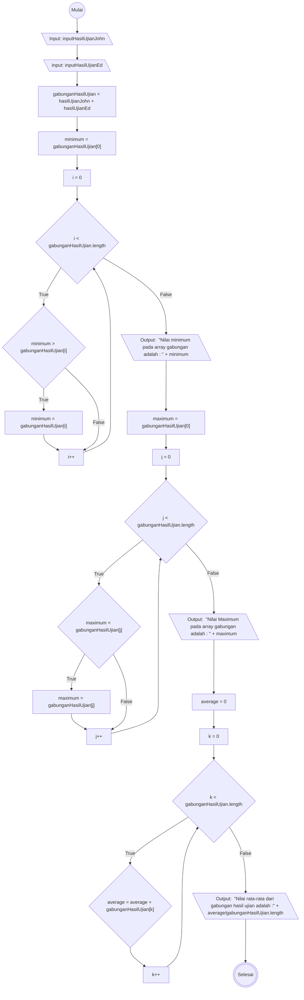

```mermaid
flowchart TD

start@{"shape": circle, "label": "Mulai"}
inputHasilUjianJohn@{"shape": lean-l, "label": "Input: inputHasilUjianJohn"}
inputHasilUjianEd@{"shape": lean-l, "label": "Input: inputHasilUjianEd"}
combineHasilUjian@{"shape": rectangle, "label": "gabunganHasilUjian = hasilUjianJohn + hasilUjianEd"}

%% Minimum
minimumEqGabunganZero@{"shape": rectangle, "label": "minimum = gabunganHasilUjian[0]"}
iEqZero@{"shape": rectangle, "label": i = 0}
isIltgabunganLength@{"shape": diamond, "label": "i < gabunganHasilUjian.length"}
isIltgabunganLengthTrue@{"shape": diamond, "label": "minimum > gabunganHasilUjian[i]"}
isMinimumgtgabunganLengthTrue@{"shape": rectangle, "label": "minimum = gabunganHasilUjian[i]"}
ipp@{"shape": rectangle, "label": "i++"}
outputMinimum@{"shape": lean-l, "label": "Output:  #quot;Nilai minimum pada array gabungan adalah : #quot; + minimum"}

%% Maximum
maximumEqGabunganZero@{"shape": rectangle, "label": "maximum = gabunganHasilUjian[0]"}
jEqZero@{"shape": rectangle, "label": j = 0}
isJltgabunganLength@{"shape": diamond, "label": "j < gabunganHasilUjian.length"}
isJltgabunganLengthTrue@{"shape": diamond, "label": "maximum < gabunganHasilUjian[j]"}
isMaximumgtgabunganLengthTrue@{"shape": rectangle, "label": "maximum = gabunganHasilUjian[j]"}
jpp@{"shape": rectangle, "label": "j++"}
outputMaximum@{"shape": lean-l, "label": "Output:  #quot;Nilai Maximum pada array gabungan adalah : #quot; + maximum"}

%% Average
averageEqZero@{"shape": rectangle, "label": "average = 0"}
kEqZero@{"shape": rectangle, "label": k = 0}
iskltgabunganLength@{"shape": diamond, "label": "k < gabunganHasilUjian.length"}
iskltgabunganLengthTrue@{"shape": diamond, "label": "average = average + gabunganHasilUjian[k]"}
kpp@{"shape": rectangle, "label": "k++"}
outputAverage@{"shape": lean-l, "label": "Output:  #quot;Nilai rata-rata dari gabungan hasil ujian adalah :#quot; + average/gabunganHasilUjian.length"}

stop@{"shape": dbl-circ, "label": "Selesai"}

start-->inputHasilUjianJohn-->inputHasilUjianEd-->combineHasilUjian-->minimumEqGabunganZero

%% Minimum
minimumEqGabunganZero-->iEqZero-->isIltgabunganLength
isIltgabunganLength--True-->isIltgabunganLengthTrue--True-->isMinimumgtgabunganLengthTrue-->ipp
isIltgabunganLengthTrue--False-->ipp-->isIltgabunganLength 
isIltgabunganLength--False-->outputMinimum-->maximumEqGabunganZero

%% Maximum
maximumEqGabunganZero-->jEqZero-->isJltgabunganLength
isJltgabunganLength--True-->isJltgabunganLengthTrue--True-->isMaximumgtgabunganLengthTrue-->jpp
isJltgabunganLengthTrue--False-->jpp-->isJltgabunganLength 
isJltgabunganLength--False-->outputMaximum-->averageEqZero

%% Average
averageEqZero-->kEqZero-->iskltgabunganLength
iskltgabunganLength--True-->iskltgabunganLengthTrue-->kpp-->
iskltgabunganLength--False-->outputAverage-->stop


```